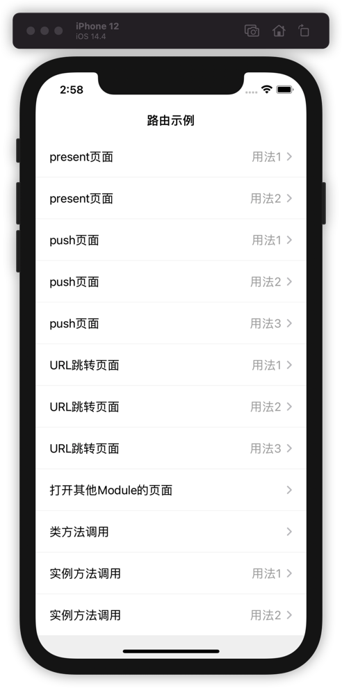

# SwiftMediator
Swift 路由和模块通信解耦工具。

使用类名反射创建对象，并且通过Mirror反射属性赋值，达到通过字符串的方式解耦并且支持跳转页面、方法调用。

 可以让模块间无耦合的调用服务、页面跳转。无需注册，不需要协议，只需要知道目标VC的类名和module名称。

AppDelegate、SceneDelegate解耦工具，只需要在主工程留下钩子即可，用法详见Demo。

|  |  |
| ---------- | ---------- |
|            |            |


## 使用
### 原生跳转
```swift
SwiftMediator.shared.present(moduleName: “SwiftMediator”, toVC: “TestVC”,paramsDic: [“str”:”123123","titleName":"23452345”,”num”:13,”dic":["a":12,"b":"100"]])
```
或者
```swift
SwiftMediator.shared.push(moduleName: “SwiftMediator”, toVC: “TestVC”,paramsDic: [“str”:”123123","titleName":"23452345","num”:13,”dic”:["a":12,"b":"100"]])
```

### URL跳转
```swift
SwiftMediator.shared.openUrl(“app://present/SwiftMediator/TestVC?str=123&titleName=456&num=111")
```

## API
### URL跳转

URL路由跳转 跳转区分Push、present、fullScreen，根据拆分URL的scheme，host，path，query拿到所用的参数

* scheme：APP标记scheme，区分APP跳转，APP内使用可传任意

* host：可传递push、present、fullScreen用于区分跳转样式

* path：/modulename/vcname，用于获取组件名和VC名

* query：采用key=value&key=value方式拼接，可转换成字典

  ```swift
      /// URL路由跳转 跳转区分Push、present、fullScreen
      /// - Parameter urlString:调用原生页面功能 scheme ://push/moduleName/vcName?quereyParams
      public func openUrl(_ urlString: String?) 
  ```

### Push
```swift
    /// 路由Push
    /// - Parameters:
    ///   - fromVC: 从那个页面起跳--不传默认取最上层VC
    ///   - moduleName: 目标VC所在组件名称
    ///   - vcName: 目标VC名称
    ///   - paramsDic: 参数字典
    ///   - animated: 是否有动画
    public func push(_ vcName: String,
                     moduleName: String? = nil,
                     fromVC: UIViewController? = nil,
                     paramsDic:[String:Any]? = nil,
                     animated: Bool = true) 

    /// 简单Push,提前初始化好VC
    /// - Parameters:
    ///   - vc: 已初始化好的VC对象
    ///   - fromVC: 从哪个页面push,不传则路由选择最上层VC
    ///   - animated: 是否有动画
    public func push(_ vc: UIViewController?,
                     fromVC: UIViewController? = nil,
                     animated: Bool = true) 
```

### Present
```swift
    /// 路由present
    /// - Parameters:
    ///   - fromVC: 从那个页面起跳--不传默认取最上层VC
    ///   - moduleName: 目标VC所在组件名称
    ///   - vcName: 目标VC名称
    ///   - paramsDic: 参数字典
    ///   - modelStyle: 0:模态样式为默认，1:全屏模态,2:custom
    ///   - needNav: 是否需要导航栏
    ///   - animated: 是否有动画
    public func present(_ vcName: String,
                        moduleName: String? = nil,
                        paramsDic:[String:Any]? = nil,
                        fromVC: UIViewController? = nil,
                        needNav: Bool = true,
                        modelStyle: Int = 0,
                        animated: Bool = true) 


    /// 简单present,提前初始化好VC
    /// - Parameters:
    ///   - vc: 已初始化好的VC对象
    ///   - fromVC: 从哪个页面push,不传则路由选择最上层VC
    ///   - needNav: 是否需要导航栏
    ///   - modelStyle: 0:模态样式为默认，1:全屏模态,2:custom
    ///   - animated: 是否有动画
    public func present(_ vc: UIViewController?,
                        fromVC: UIViewController? = nil,
                        needNav: Bool = true,
                        modelStyle: Int = 0,
                        animated: Bool = true) 
```

### 获取最上层VC
* currentNavigationController

  ```swift
      /// 获取顶层Nav 根据window
      public func currentNavigationController() -> UINavigationController?
  ```

* currentViewController

  ```swift
      /// 获取顶层VC 根据window
      public func currentViewController() -> UIViewController?
  ```

### 初始化VC
```swift
    /// 反射VC初始化并且赋值
    /// - Parameters:
    ///   - moduleName: 组件boundle名称，不传则为默认命名空间
    ///   - vcName: VC名称
    ///   - dic: 参数字典//由于是KVC赋值，必须要在参数上标记@objc
    @discardableResult
    public func initVC(_ vcName: String,
                       moduleName: String? = nil,
                       dic: [String : Any]? = nil) -> UIViewController?
```

### 初始化对象

```swift
    /// 反射objc初始化并且赋值 继承NSObject
    /// - Parameters:
    ///   - objcName: objcName
    ///   - moduleName: moduleName
    ///   - dic: 参数字典//由于是KVC赋值，必须要在参数上标记@objc
    /// - Returns: objc
    @discardableResult
    public func initObjc(_ objcName: String,
                         moduleName: String? = nil,
                         dic: [String : Any]? = nil) -> NSObject?
```

### 方法调用: swift当前仅支持简单参数传递，闭包Block等参数OC版本的[JHMediator](https://github.com/jackiehu/JHMediator)支持

```swift
    /// 路由调用实例对象方法：必须标记@objc  例子： @objc class func qqqqq(_ name: String)
    /// - Parameters:
    ///   - objc: 初始化好的对象
    ///   - selName: 方法名
    ///   - param: 参数1
    ///   - otherParam: 参数2
    @discardableResult
    public func callObjcMethod(objc: AnyObject,
                               selName: String,
                               param: Any? = nil,
                               otherParam: Any? = nil ) -> Unmanaged<AnyObject>?
```

```swift
    /// 路由调用类方法：必须标记@objc  例子：@objc  func qqqqq(_ name: String)
    /// - Parameters:
    ///   - moduleName: 组件名称
    ///   - className: 类名称
    ///   - selName: 方法名
    ///   - param: 参数1
    ///   - otherParam: 参数2
    @discardableResult
    public func callClassMethod(className: String,
                                selName: String,
                                moduleName: String? = nil,
                                param: Any? = nil,
                                otherParam: Any? = nil ) -> Unmanaged<AnyObject>?
```


### AppDelegateMediator解耦

用于AppDelegate解耦，可创建多个钩子分别用于各种第三方初始化

用法：

```swift
///创建一个或多个钩子
class AppDe: AppDelegateMediator{
    var window: UIWindow?
    init(_ win : UIWindow?) {
        window = win
    }
    
    func application(_ application: UIApplication, didFinishLaunchingWithOptions launchOptions: [UIApplication.LaunchOptionsKey : Any]? = nil) -> Bool {
        print("UIApplication在这启动")
        return true
    }

    func applicationWillResignActive(_ application: UIApplication) {
        print("UIApplication在这将要进入后台")
    }
}
```

```swift
@UIApplicationMain
class AppDelegate: UIResponder, UIApplicationDelegate {

    var window: UIWindow?
///在AppDelegate初始化管理器，并且传递钩子的数组
    lazy var manager: AppDelegateManager = {
        return AppDelegateManager.init(delegates: [AppDe.init(window)])
    }()

    func application(_ application: UIApplication, didFinishLaunchingWithOptions launchOptions: [UIApplication.LaunchOptionsKey: Any]?) -> Bool {
      ///把代理执行交给管理器
        manager.application(application, didFinishLaunchingWithOptions: launchOptions)
        return true
    }
```

### SceneDelegateMediator解耦

用于SceneDelegate解耦，iOS13后可能会用到。可创建多个钩子分别用于各种第三方初始化

用法：

```swift
@available(iOS 13.0, *)
///创建一个或多个钩子
class SceneDe: SceneDelegateMediator{
  
    func scene(_ scene: UIScene, willConnectTo session: UISceneSession, options connectionOptions: UIScene.ConnectionOptions) {
        print("UIScene在这启动")
        guard let _ = (scene as? UIWindowScene) else { return }
    }
    
    func sceneWillResignActive(_ scene: UIScene) {
        print("UIScene在这将要进入后台")
    }
}
```

```swift
@available(iOS 13.0, *)
class SceneDelegate: UIResponder, UIWindowSceneDelegate {
///在SceneDelegate初始化管理器，并且传递钩子的数组
    lazy var manager: SceneDelegateManager = {
        return SceneDelegateManager.init(delegates: [SceneDe()])
    }()

    func scene(_ scene: UIScene, willConnectTo session: UISceneSession, options connectionOptions: UIScene.ConnectionOptions) {
///把代理执行交给管理器
        manager.scene(scene, willConnectTo: session, options: connectionOptions)
        guard let _ = (scene as? UIWindowScene) else { return }
    }
```


详细用法参见Demo **ViewController**   **DelegateMediator**

### 安装支持

#### cocoapods导入

`pod 'SwiftMediator'`

#### SPM导入

`https://github.com/jackiehu/SwiftMediator`

#### 手动导入