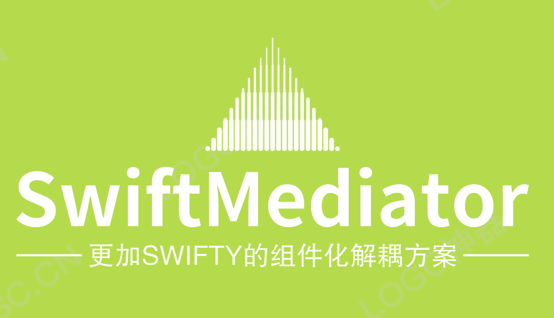
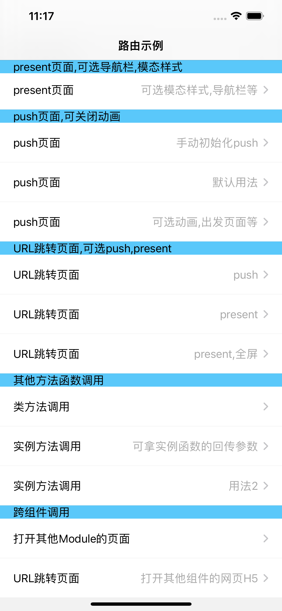
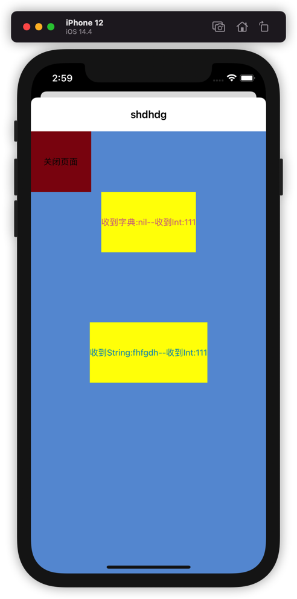

[](http://cocoapods.org/pods/SwiftMediator)
[](https://swift.org/package-manager/)


Tool for decoupling Swift routing and module communication.

Componentized routing middleware with target-action scheme.

Support to create objects using string class name reflection, and pass dictionary parameters Mirror reflection attributes and assign values to achieve decoupling through strings and support page jumps and function method execution calls.

Support OpenURL method to jump to the page and pass parameters.

It is possible to call services and page jumps without coupling between modules. No registration, no agreement, just need to know the class name and module name of the target VC.

The AppDelegate and SceneDelegate decoupling tools only need to leave hooks in the main project. See Demo for usage details.

|  |  |
| ---------------- | ---------------- |
|                  |                  |


## Install

### Cocoapods

1. Add `pod 'SwiftMediator'` to Podfile

2. Execute `pod install or pod update`

3. Import `import SwiftMediator`

### Swift Package Manager

Starting from Xcode 11, the Swift Package Manager is integrated, which is very convenient to use. SwiftMediator also supports integration via the Swift Package Manager.

Select `File > Swift Packages > Add Pacakage Dependency` in Xcode's menu bar, and enter in the search bar

`https://github.com/jackiehu/SwiftMediator`, you can complete the integration


## Usage
### Native present or push
```swift
SwiftMediator.shared.present(moduleName: “SwiftMediator”, toVC: “TestVC”,paramsDic: [“str”:”123123","titleName":"23452345”,”num”:13,”dic":["a":12,"b":"100"]])
```
```swift
SwiftMediator.shared.push(moduleName: “SwiftMediator”, toVC: “TestVC”,paramsDic: [“str”:”123123","titleName":"23452345","num”:13,”dic”:["a":12,"b":"100"]])
```

### URL
```swift
SwiftMediator.shared.openUrl(“app://present/SwiftMediator/TestVC?str=123&titleName=456&num=111")
```


## API

### URL jump

URL routing jump Jump to distinguish between Push, present, and fullScreen, and get the parameters used according to the scheme, host, path, and query of the split URL

* scheme: APP mark scheme, distinguish APP jump, use in APP can pass any

* host: push, present, fullScreen can be passed to distinguish the jump style

* path: /modulename/vcname, used to get component name and VC name

* query: spliced by key=value&key=value, which can be converted into a dictionary

  ```swift
  /// URL routing jump Jump to distinguish Push, present, fullScreen
       /// - Parameter urlString: Call native page function scheme ://push/moduleName/vcName?quereyParams
       public func openUrl(_ urlString: String?)
  ```

### Push
```swift
/// Routing Push
     /// - Parameters:
     /// - fromVC: Jump from that page--if not passed, the top VC is taken by default
     /// - moduleName: The name of the component where the target VC is located
     /// - vcName: target VC name
     /// - paramsDic: parameter dictionary
     /// - animated: whether there is animation
    public func push(_ vcName: String,
                     moduleName: String? = nil,
                     fromVC: UIViewController? = nil,
                     paramsDic:[String:Any]? = nil,
                     animated: Bool = true) 

/// Simple Push, initialize VC in advance
     /// - Parameters:
     /// - vc: initialized VC object
     /// - fromVC: From which page to push, if not, the route selects the top VC
     /// - animated: whether there is animation
    public func push(_ vc: UIViewController?,
                     fromVC: UIViewController? = nil,
                     animated: Bool = true) 
```

### Present
```swift
/// route present
     /// - Parameters:
     /// - fromVC: Jump from that page--if not passed, the top VC is taken by default
     /// - moduleName: The name of the component where the target VC is located
     /// - vcName: target VC name
     /// - paramsDic: parameter dictionary
     /// - modelStyle: 0: modal style is default, 1: full screen modal, 2: custom
     /// - needNav: Whether to need a navigation bar
     /// - animated: whether there is animation
    public func present(_ vcName: String,
                        moduleName: String? = nil,
                        paramsDic:[String:Any]? = nil,
                        fromVC: UIViewController? = nil,
                        needNav: Bool = true,
                        modelStyle: Int = 0,
                        animated: Bool = true) 


/// Simple present, initialize VC in advance
     /// - Parameters:
     /// - vc: initialized VC object
     /// - fromVC: From which page to push, if not, the route selects the top VC
     /// - needNav: Whether to need a navigation bar
     /// - modelStyle: 0: modal style is default, 1: full screen modal, 2: custom
     /// - animated: whether there is animation
    public func present(_ vc: UIViewController?,
                        fromVC: UIViewController? = nil,
                        needNav: Bool = true,
                        modelStyle: Int = 0,
                        animated: Bool = true) 
```

### Get the top UIViewController
* currentNavigationController

  ```swift
      /// Get the top-level UINavigationController according to the window
      public func currentNavigationController() -> UINavigationController?
  ```

* currentViewController

  ```swift
      /// Get the top-level UIViewController according to the window
      public func currentViewController() -> UIViewController?
  ```

### Initialize UIViewController
```swift
   /// Reflect VC initialization and assignment
     /// - Parameters:
     /// - moduleName: component boundle name, if not passed, it will be the default namespace
     /// - vcName: VC name
     /// - dic: parameter dictionary // Since it is a KVC assignment, @objc must be marked on the parameter
    @discardableResult
    public func initVC(_ vcName: String,
                       moduleName: String? = nil,
                       dic: [String : Any]? = nil) -> UIViewController?
```

### initialize object

```swift
/// Reflect objc initialization and assignment Inherit NSObject
     /// - Parameters:
     /// - objcName: objcName
     /// - moduleName: moduleName
     /// - dic: parameter dictionary // Since it is a KVC assignment, @objc must be marked on the parameter
     /// - Returns: objc
    @discardableResult
    public func initObjc(_ objcName: String,
                         moduleName: String? = nil,
                         dic: [String : Any]? = nil) -> NSObject?
```

### Method call: Support parameters such as closure Block, please refer to Demo for detailed usage

```swift
/// Routing call instance object method: @objc must be marked Example: @objc class func qqqqq(_ name: String)
     /// - Parameters:
     /// - objc: initialized object
     /// - selName: method name
     /// - param: parameter 1
     /// - otherParam: parameter 2
    @discardableResult
    public func callObjcMethod(objc: AnyObject,
                               selName: String,
                               param: Any? = nil,
                               otherParam: Any? = nil ) -> Unmanaged<AnyObject>?
```

```swift
/// Routing call class method: @objc must be marked Example: @objc func qqqqq(_ name: String)
     /// - Parameters:
     /// - moduleName: component name
     /// - className: class name
     /// - selName: method name
     /// - param: parameter 1
     /// - otherParam: parameter 2
    @discardableResult
    public func callClassMethod(className: String,
                                selName: String,
                                moduleName: String? = nil,
                                param: Any? = nil,
                                otherParam: Any? = nil ) -> Unmanaged<AnyObject>?
```


### AppDelegateMediator Decoupling

Used for AppDelegate decoupling, multiple hooks can be created for various third-party initializations

usage:

```swift
///Create one or more hooks
class AppDe: AppDelegateMediator{
    var window: UIWindow?
    init(_ win : UIWindow?) {
        window = win
    }
    
    func application(_ application: UIApplication, didFinishLaunchingWithOptions launchOptions: [UIApplication.LaunchOptionsKey : Any]? = nil) -> Bool {
        print("UIApplication在这启动")
        return true
    }

    func applicationWillResignActive(_ application: UIApplication) {
        print("UIApplication在这将要进入后台")
    }
}
```

```swift
@UIApplicationMain
class AppDelegate: UIResponder, UIApplicationDelegate {

    var window: UIWindow?
///Initialize the manager in AppDelegate and pass the array of hooks
    lazy var manager: AppDelegateManager = {
        return AppDelegateManager.init(delegates: [AppDe.init(window)])
    }()

    func application(_ application: UIApplication, didFinishLaunchingWithOptions launchOptions: [UIApplication.LaunchOptionsKey: Any]?) -> Bool {
      /// Hand over the agent execution to the manager
        manager.application(application, didFinishLaunchingWithOptions: launchOptions)
        return true
    }
```

### SceneDelegateMediator Decoupling

Used for SceneDelegate decoupling, may be used after iOS13. Multiple hooks can be created for various third-party initializations

usage：

```swift
@available(iOS 13.0, *)
///Create one or more hooks
class SceneDe: SceneDelegateMediator{
  
    func scene(_ scene: UIScene, willConnectTo session: UISceneSession, options connectionOptions: UIScene.ConnectionOptions) {
        print("UIScene在这启动")
        guard let _ = (scene as? UIWindowScene) else { return }
    }
    
    func sceneWillResignActive(_ scene: UIScene) {
        print("UIScene在这将要进入后台")
    }
}
```

```swift
@available(iOS 13.0, *)
class SceneDelegate: UIResponder, UIWindowSceneDelegate {
///Initialize the manager in SceneDelegate and pass the array of hooks
    lazy var manager: SceneDelegateManager = {
        return SceneDelegateManager.init(delegates: [SceneDe()])
    }()

    func scene(_ scene: UIScene, willConnectTo session: UISceneSession, options connectionOptions: UIScene.ConnectionOptions) {
/// Hand over the agent execution to the manager
        manager.scene(scene, willConnectTo: session, options: connectionOptions)
        guard let _ = (scene as? UIWindowScene) else { return }
    }
```

## 更多砖块工具加速APP开发

[](https://github.com/jackiehu/SwiftBrick)

[](https://github.com/jackiehu/SwiftLog)

[](https://github.com/jackiehu/SwiftMesh)

[](https://github.com/jackiehu/SwiftNotification)


