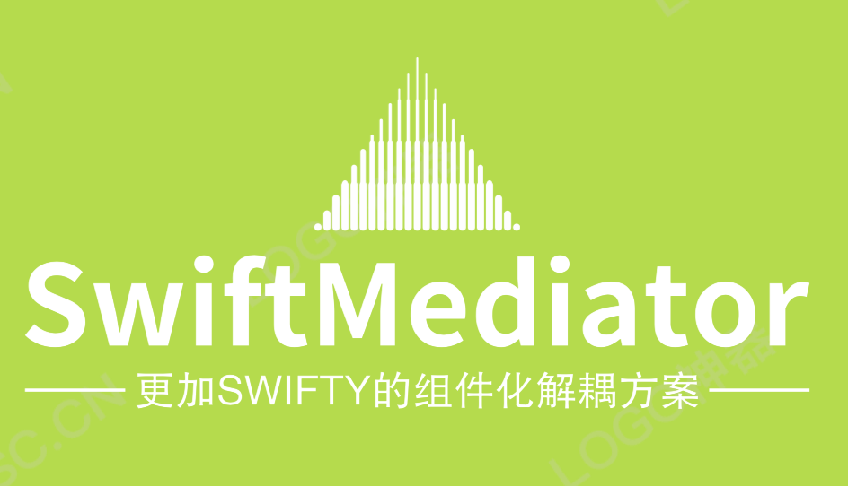
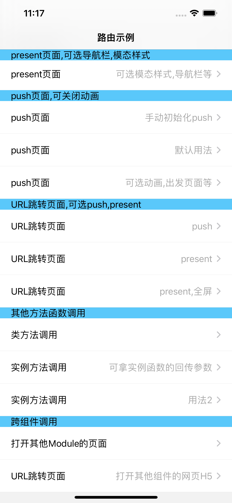
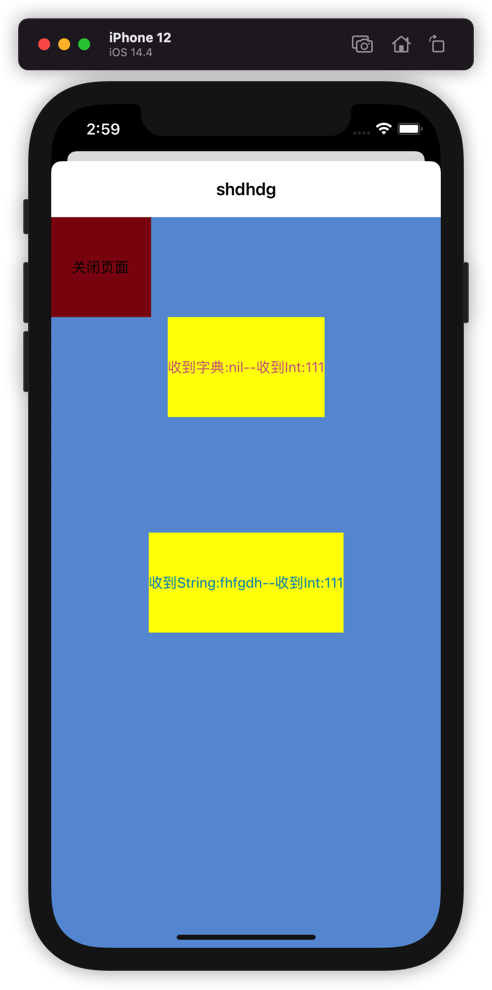

[](http://cocoapods.org/pods/SwiftMediator)
[](https://swift.org/package-manager/)


Tool for decoupling Swift routing and module communication.

Componentized routing middleware with target-action scheme.

Support creating objects using string class name reflection, and passing dictionary parameters via Mirror reflection to assign values, achieving decoupling through strings. Supports page navigation and function method execution.

Support OpenURL method for page navigation with parameter passing.

Enable cross-module service calls and page navigation without coupling. No registration, no protocol needed -- just the target VC's class name and module name.

AppDelegate and SceneDelegate decoupling tools: only need to leave hooks in the main project. See Demo for details.

|  |  |
| ---------------- | ---------------- |
|                  |                  |


## Installation

### CocoaPods

1. Add `pod 'SwiftMediator'` to Podfile

2. Run `pod install` or `pod update`

3. Import `import SwiftMediator`

### Swift Package Manager

Starting from Xcode 11, Swift Package Manager is integrated and very convenient. SwiftMediator also supports SPM integration.

Select `File > Swift Packages > Add Package Dependency` in Xcode's menu bar, then enter:

`https://github.com/zjinhu/SwiftMediator` to complete integration.

### Manual Installation

Drag the `SwiftMediator` folder from the `Sources` directory into your project.


## Usage

### Native Push / Present
```swift
// Present a view controller
SwiftMediator.shared.present("TestVC", moduleName: "SwiftMediator", paramsDic: ["str":"123123", "titleName":"23452345", "num":13, "dic":["a":12, "b":"100"]])

// Push a view controller
SwiftMediator.shared.push("TestVC", moduleName: "SwiftMediator", paramsDic: ["str":"123123", "titleName":"23452345", "num":13, "dic":["a":12, "b":"100"]])
```

### URL Routing
```swift
SwiftMediator.shared.openUrl("app://push/SwiftMediator/TestVC?str=123&titleName=456&num=111")
```

### SwiftUI Navigation
```swift
// Push a SwiftUI View
SwiftMediator.shared.push(MySwiftUIView(), title: "My View")
```


## API Reference

### URL Routing

URL routing automatically distinguishes between Push, Present, and fullScreen modal presentations. Parameters are extracted from the URL's scheme, host, path, and query components.

* **scheme**: APP marker for deeplink, can be any value for in-app routing

* **host**: `push`, `present`, or `fullScreen` to distinguish navigation style

* **path**: `/modulename/vcname` to get component name and VC name

* **query**: `key=value&key=value` format, automatically converted to dictionary

```swift
/// URL routing with automatic Push/Present/fullScreen detection
/// - Parameter urlString: URL format: scheme://push|present|fullScreen/moduleName/vcName?queryParams
public func openUrl(_ urlString: String?)
```

### Push Navigation
```swift
/// Push by class name (auto-instantiates VC)
/// - Parameters:
///   - vcName: Target view controller class name
///   - moduleName: Component bundle name (defaults to main bundle if nil)
///   - fromVC: Source view controller (defaults to top VC if nil)
///   - paramsDic: Parameter dictionary for KVC assignment
///   - animated: Whether to show animation
public func push(_ vcName: String,
                 moduleName: String? = nil,
                 fromVC: UIViewController? = nil,
                 paramsDic: [String: Any]? = nil,
                 animated: Bool = true)

/// Push with pre-initialized VC
/// - Parameters:
///   - vc: Pre-initialized view controller
///   - fromVC: Source view controller (defaults to top VC if nil)
///   - animated: Whether to show animation
public func push(_ vc: UIViewController?,
                 fromVC: UIViewController? = nil,
                 animated: Bool = true)
```

### Pop Navigation
```swift
/// Pop to previous page
public func pop(animated: Bool = true)

/// Pop to root page
public func popToRoot(animated: Bool = true)

/// Pop to specific view controller
public func popTo(_ vc: UIViewController) -> Bool

/// Pop to view controller at index
public func popTo(_ index: Int) -> Bool

/// Pop to view controller with matching navigation bar title
public func popTo(_ navigationBarTitle: String) -> Bool
```

### Modal Presentation
```swift
/// Present by class name (auto-instantiates VC)
/// - Parameters:
///   - vcName: Target view controller class name
///   - moduleName: Component bundle name (defaults to main bundle if nil)
///   - paramsDic: Parameter dictionary for KVC assignment
///   - fromVC: Source view controller (defaults to top VC if nil)
///   - needNav: Whether to wrap in navigation controller
///   - modelStyle: Modal presentation style
///   - animated: Whether to show animation
public func present(_ vcName: String,
                    moduleName: String? = nil,
                    paramsDic: [String: Any]? = nil,
                    fromVC: UIViewController? = nil,
                    needNav: Bool = false,
                    modelStyle: UIModalPresentationStyle = .fullScreen,
                    animated: Bool = true)

/// Present with pre-initialized VC
public func present(_ vc: UIViewController?,
                    fromVC: UIViewController? = nil,
                    needNav: Bool = false,
                    modelStyle: UIModalPresentationStyle = .fullScreen,
                    animated: Bool = true)

/// Dismiss current page (auto-detects pop vs dismiss)
public func dismissVC(animated: Bool = true)
```

### Get Top View Controller
```swift
/// Get current top-most UINavigationController
public static func currentNavigationController() -> UINavigationController?

/// Get current top-most UIViewController
public static func currentViewController() -> UIViewController?
```

### Object Initialization
```swift
/// Initialize UIViewController via reflection with property assignment
/// - Parameters:
///   - vcName: View controller class name
///   - moduleName: Component bundle name (defaults to main bundle if nil)
///   - dic: Parameter dictionary (properties must be marked @objc for KVC)
/// - Returns: Initialized view controller, or nil if failed
@discardableResult
public func initVC(_ vcName: String,
                   moduleName: String? = nil,
                   dic: [String: Any]? = nil) -> UIViewController?

/// Initialize UIView via reflection with property assignment
@discardableResult
public func initView(_ viewName: String,
                     moduleName: String? = nil,
                     dic: [String: Any]? = nil) -> UIView?

/// Initialize NSObject subclass via reflection with property assignment
@discardableResult
public func initObjc(_ objcName: String,
                     moduleName: String? = nil,
                     dic: [String: Any]? = nil) -> NSObject?
```

### Method Invocation
```swift
/// Invoke instance method dynamically
/// - Note: Method must be marked @objc, e.g., @objc func myMethod(_ param: Any)
/// - Parameters:
///   - objc: Initialized object instance
///   - selName: Method name
///   - param: First parameter
///   - otherParam: Second parameter
/// - Returns: Execution result, or nil if method not found
@discardableResult
public func callObjcMethod(objc: AnyObject,
                           selName: String,
                           param: Any? = nil,
                           otherParam: Any? = nil) -> Unmanaged<AnyObject>?

/// Invoke class method dynamically
/// - Note: Method must be marked @objc, e.g., @objc class func myMethod(_ param: Any)
/// - Parameters:
///   - className: Class name
///   - selName: Method name
///   - moduleName: Component bundle name
///   - param: First parameter
///   - otherParam: Second parameter
/// - Returns: Execution result, or nil if class or method not found
@discardableResult
public func callClassMethod(className: String,
                            selName: String,
                            moduleName: String? = nil,
                            param: Any? = nil,
                            otherParam: Any? = nil) -> Unmanaged<AnyObject>?
```

### SwiftUI Integration
```swift
/// Push a SwiftUI View onto the navigation stack
/// - Parameters:
///   - view: SwiftUI View
///   - title: Navigation bar title
public func push<V: View>(_ view: V, title: String? = nil)

/// Pop to view controller with matching title
public func popToTitle(_ navigationBarTitle: String) -> Bool

/// Convert SwiftUI View to UIViewController (View extension)
public func getVC() -> UIViewController
```

### URL Encoding Utilities
```swift
/// Encode string for safe URL usage
public func urlEncoded() -> String

/// Decode URL-encoded string back to original
public func urlDecoded() -> String
```

### Get Module Namespace
```swift
/// Get the module namespace where the object resides
public func getModuleName() -> String
```


## AppDelegateMediator Decoupling

Used for AppDelegate decoupling. Multiple hooks can be created for various third-party initializations.

Usage:

```swift
// Create one or more hooks
class AppDe: AppDelegateMediator {
    var window: UIWindow?
    init(_ win: UIWindow?) {
        window = win
    }
    
    func application(_ application: UIApplication, didFinishLaunchingWithOptions launchOptions: [UIApplication.LaunchOptionsKey: Any]? = nil) -> Bool {
        print("App launched")
        return true
    }

    func applicationWillResignActive(_ application: UIApplication) {
        print("App will resign active")
    }
}
```

```swift
@main
class AppDelegate: UIResponder, UIApplicationDelegate {

    var window: UIWindow?
    
    // Initialize the manager in AppDelegate and pass the array of hooks
    lazy var manager: AppDelegateManager = {
        return AppDelegateManager(delegates: [AppDe(window)])
    }()

    func application(_ application: UIApplication, didFinishLaunchingWithOptions launchOptions: [UIApplication.LaunchOptionsKey: Any]?) -> Bool {
        // Hand over delegate execution to the manager
        manager.application(application, didFinishLaunchingWithOptions: launchOptions)
        return true
    }
    
    func applicationWillResignActive(_ application: UIApplication) {
        manager.applicationWillResignActive(application)
    }
}
```


## SceneDelegateMediator Decoupling

Used for SceneDelegate decoupling (iOS 13+). Multiple hooks can be created for various third-party initializations.

Usage:

```swift
@available(iOS 13.0, *)
class SceneDe: SceneDelegateMediator {
    func scene(_ scene: UIScene, willConnectTo session: UISceneSession, options connectionOptions: UIScene.ConnectionOptions) {
        print("Scene connected")
        guard let _ = (scene as? UIWindowScene) else { return }
    }
    
    func sceneWillResignActive(_ scene: UIScene) {
        print("Scene will resign active")
    }
}
```

```swift
@available(iOS 13.0, *)
class SceneDelegate: UIResponder, UIWindowSceneDelegate {
    
    // Initialize the manager in SceneDelegate and pass the array of hooks
    lazy var manager: SceneDelegateManager = {
        return SceneDelegateManager(delegates: [SceneDe()])
    }()

    func scene(_ scene: UIScene, willConnectTo session: UISceneSession, options connectionOptions: UIScene.ConnectionOptions) {
        // Hand over delegate execution to the manager
        manager.scene(scene, willConnectTo: session, options: connectionOptions)
        guard let _ = (scene as? UIWindowScene) else { return }
    }
    
    func sceneWillResignActive(_ scene: UIScene) {
        manager.sceneWillResignActive(scene)
    }
}
```


## AI Skills Guide

SwiftMediator includes a `SKILLS.md` file designed to help AI assistants (like Cursor, GitHub Copilot, Claude, etc.) quickly understand and correctly use the framework.

### What is SKILLS.md?

`SKILLS.md` is a comprehensive reference document containing:
- Complete API documentation with code examples
- Architecture overview and file structure
- Common usage patterns and best practices
- Important notes and gotchas (e.g., `@objc` requirements for KVC)
- Ready-to-copy code snippets for AI assistants

### How to Use with AI Assistants

#### Method 1: Reference in Chat

When asking an AI assistant to help with SwiftMediator-related tasks, simply mention:

> "Use the SwiftMediator framework, refer to SKILLS.md for API details"

The AI will read `SKILLS.md` and provide accurate code suggestions.

#### Method 2: Add to AI Context

For IDE-based AI assistants (Cursor, Copilot Chat, etc.), you can:

1. **Cursor**: Add `@SKILLS.md` to your chat context or include it in `.cursor/rules/`
2. **GitHub Copilot**: Reference the file in your prompt or add to workspace context
3. **Claude/ChatGPT**: Upload or paste the contents of `SKILLS.md` at the start of your session

#### Method 3: Project-Level Configuration

For Cursor users, create `.cursor/rules/swiftmediator.mdc`:

```markdown
---
description: SwiftMediator routing and decoupling framework
alwaysApply: false
---

When working with SwiftMediator routing:
- Refer to @SKILLS.md for complete API reference
- Remember: KVC properties MUST be marked @objc
- Remember: Dynamic methods MUST be marked @objc
- Use SwiftMediator.shared for all routing operations
```

### Quick Examples

#### Ask AI to add navigation

> "Add a button that pushes DetailVC from ModuleB with itemId parameter"

AI will generate:
```swift
SwiftMediator.shared.push("DetailVC", moduleName: "ModuleB", paramsDic: ["itemId": "12345"])
```

#### Ask AI to set up AppDelegate hooks

> "Add Firebase and Analytics initialization using AppDelegateMediator"

AI will generate proper hook classes and AppDelegate setup.

#### Ask AI to handle deeplinks

> "Handle incoming URLs using SwiftMediator URL routing"

AI will generate:
```swift
func application(_ app: UIApplication, open url: URL, options: [UIApplication.OpenURLOptionsKey: Any] = [:]) -> Bool {
    SwiftMediator.shared.openUrl(url.absoluteString)
    return true
}
```

---

## More Tools to Accelerate APP Development

[](https://github.com/zjinhu/SwiftBrick)

[](https://github.com/zjinhu/SwiftLog)

[](https://github.com/zjinhu/SwiftMesh)

[](https://github.com/zjinhu/SwiftNotification)

[](https://github.com/zjinhu/SwiftShow)

[](https://github.com/zjinhu/SwiftButton)

[](https://github.com/zjinhu/SwiftDatePicker)
